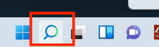
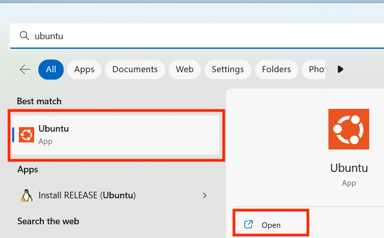
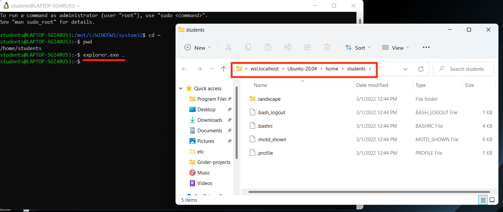
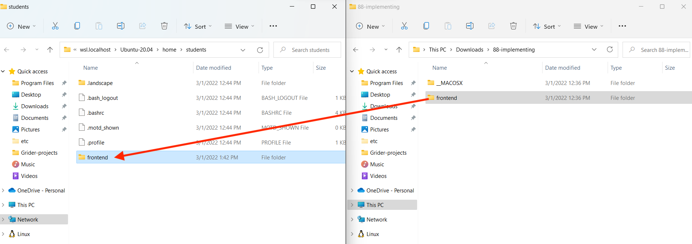
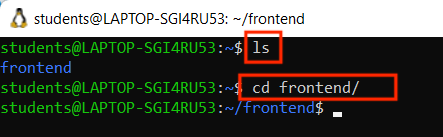
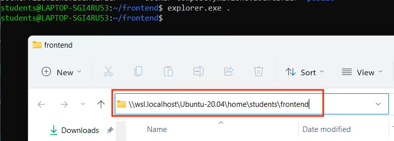
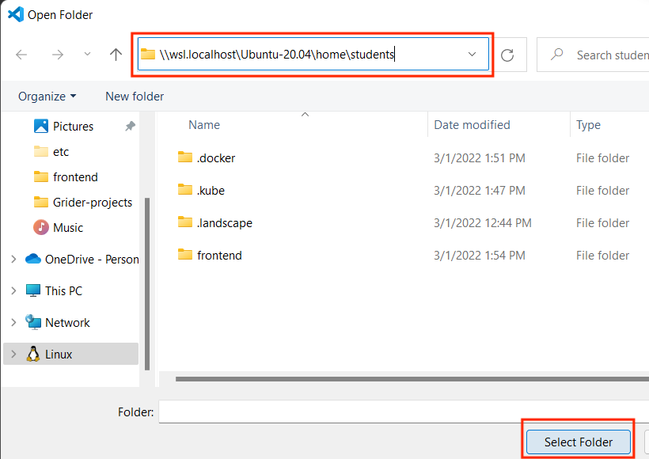

# Environment based setup for running Application and tests inside container

## Develeopment Environment setup

**Building a Docker Image from a Specific Dockerfile**

To build an image using a specific Dockerfile, use the -f flag to specify the file name:

```bash
docker build -f <Dockerfile-name> .
```

ex -

```bash
docker build -f Dockerfile.dev .
```

**_Problem_**:
In development mode, the source code changes frequently. Since Docker images capture a snapshot of the files within the context directory (. represents the current directory), you have to rebuild the image each time you make changes to the code.

**_Solution_**:
To avoid rebuilding the image with every code change, use volumes. Volumes allow you to mount your local source code inside the running container, so changes are reflected instantly without rebuilding the image.

### VOLUMES

Instead of copying the source code directly into the container, volumes allow you to set up a reference (or "placeholder") between your local machine and the container. This ensures that changes to your local source code are instantly reflected inside the running container without needing to rebuild the image.

**Setting up Volumes**

You can use the -v flag to create these mappings:

```bash
docker run -p 3000:3000 -v /app/node_modules -v $(pwd):/app <image-id>
```

**Understanding the Volume Setup:**

- `-v ${pwd}:/app`: This tells Docker to map the present working directory (your project folder) on your local machine to the `/app` directory inside the container. Any changes made in the local directory will be reflected in the container's `/app` directory.

- `-v /app/node_modules`: Notice that there is no colon here. This instructs Docker to keep the node_modules directory inside the container, not map it to your local machine. This is necessary because the node_modules directory is installed inside the container (based on the package.json) and doesn’t exist in your local project folder.

Without this setup, if node_modules were mapped to the local folder, it wouldn’t be found in the container since it’s created and used only inside the container.

### WSL and Windows Users
This note will cover important fixes for volumes issues and file watchers not updating changes on Windows. Please do not continue with the next lecture until you have read this note in full. Solution #2 is a best practice, however, it will require more work, configuration and code changes. Solution #1 will allow you to move forward very quickly and requires only a small code change.

#### Solution #1 (Quickest)
Many students have indicated recently in our QA that they wish to know the quickest and least complicated solution to solve the code not updating on Windows issue regardless of whether it is a best practice.  Please understand, this solution only resolves the reloading of the web application, it will not help with the re-running of the tests. Solution #2 is the only thing that will help with both the reloading of the app and the re-running of tests after a code change.

This solution assumes that the project exists on the Windows file system and was not created on or copied to the WSL Linux file system.
There is currently an undocumented solution in the latest versions of Webpack:

https://github.com/facebook/create-react-app/issues/12397

1. You can add the variable to your frontend src/package.json start script like so:

  ```bash
  "scripts": {
    "start": "WATCHPACK_POLLING=true react-scripts start",
    }
  ```


2. Build the image as you normally would:

docker build -f Dockerfile.dev -t USERNAME:frontend .

3. From the root of your frontend project directory, run the container using PowerShell:

docker run -it -p 3000:3000 -v /app/node_modules -v ${PWD}:/app USERNAME:frontend

Do not use the pwd variable shown in the course videos. This will not work with Windows terminals. Please use ${PWD} which is correct for use with PowerShell.

#### Solution #2 (Best Practice)

When using WSL to run Docker Desktop on Windows, the project should have been created on the Linux file system and all docker commands should be run within WSL as per best practices:

https://docs.docker.com/desktop/windows/wsl/#best-practices

If the project was created on the Windows file system, the volumes may not work correctly and performance may greatly suffer. To address this, you will need to copy your project to the Linux File system using the following instructions:

1. To open your WSL operating system use the search / magnifying glass in the bottom system tray:



2. Type the name of your distribution (by default it is Ubuntu) and click Open:


3. When the terminal launches it should automatically open to the home directory on the Linux filesystem.

4. Run explorer.exe . to open up the file explorer at /home/USERNAME directory within WSL:


5. Move the frontend project directory into the WSL file browser window:


6. Your project path should now look like /home/USERNAME/frontend. Run ls to confirm that you are in the correct location. Then, run cd frontend to change into the project directory.


7. Delete any node_modules or package-lock.json files that may exist in the project directory. If these were generated on the Windows file system and were copied over, they will conflict.

8. Update your Dockerfile.dev to look like this:

```bash
FROM node:16-alpine
 
USER node
 
RUN mkdir -p /home/node/app
WORKDIR /home/node/app
 
COPY --chown=node:node ./package.json ./
RUN npm install
COPY --chown=node:node ./ ./
 
CMD ["npm", "start"]
```

**Explanation of changes:**
We are specifying that the USER which will execute RUN, CMD, or ENTRYPOINT instructions will be the node user, as opposed to root (default).

https://docs.docker.com/engine/reference/builder/#user

We are then creating a directory of /home/node/app prior to the WORKDIR instruction. This will prevent a permissions issue since WORKDIR by default will create a directory if it does not exist and set ownership to root.

The inline chown commands will set ownership of the files you are copying from your local environment to the node user in the container.

The end result is that some files and directories will no longer be owned by root, and no npm processes will be run by the root user. Instead, they will all be owned and run by the node user.

9. Using the WSL terminal build your Docker image as you typically would:
`docker build -f Dockerfile.dev -t USERNAME:frontend .`

10. Using the WSL terminal, start and run a container. It is very important that you do not use a PWD variable as shown in the lecture video. Use the ~ alias for the home directory or type out the full path:
Using `~` alias:
`docker run -it -p 3000:3000 -v /home/node/app/node_modules -v ~/frontend:/home/node/app USERNAME:frontend`

Using the full path:
`docker run -it -p 3000:3000 -v /home/node/app/node_modules -v /home/YOURUSERNAME/frontend:/home/node/app USERNAME:frontend`

11. Going forward in this course, all Docker commands and projects should be run within WSL and not Windows.

Changes needed for Docker Compose - Single Container project

When we refactor this project to use Docker Compose in a few lectures, remember to update the working directory paths in your compose file:

    ```bash
    volumes:
      - /home/node/app/node_modules
      - .:/home/node/app
    ```


**Explanation of the issue**:

The core of the issue was the volume bookmarking (placeholder) was created by root. As a result, the node_modules will be owned by root. As part of the development process, the Webpack / Babel Loader will attempt to create a node_modules.cache folder as the Node user. In Node 15, 16+, this will result in a EACCES: permission denied.

**Adding WSL project folder to VSCode**
**Option #1**
https://code.visualstudio.com/docs/remote/wsl#_open-a-remote-folder-or-workspace

**Option #2**
With the terminal of your distro, make sure you are inside your frontend project directory and run the explorer.exe . command. This will open a file browser window within the WSL location. Copy the location path:
    

Go to VSCode and select File, then Open Folder. Paste the wsl address you just copied into the file browser window and click the Select Folder button:
    

This will add the project that is located in the WSL file system into your VSCode workspace.

### Achieve the same using docker-compose.yml
Instead of using this docker command to build and run the docker image, let's see how it can be done by using `docker-compose.yml` file.

```bash
services:
  react_prod_app:
    build:
      context: .
      dockerfile: Dockerfile.dev
    ports:
      - '3000:3000'
    volumes:
      - /home/node/app/node_modules
      - .:/home/node/app

# ---------- if it's not running in WSL env, instead running in linux/mac env by-default-------
# services:
#   react_prod_app:
#     build:
#       context: .
#       dockerfile: Dockerfile.dev
#     ports:
#       - '3000:3000'
#     volumes:
#       - /app/node_modules
#       - .:/app

```

### Running any other command other that default command set in the Dockerfile.dev
ex- `docker run -it manisha_sinha/react_prod npm run test` - here we are overriding the default command

Sincr this will always run the same FS in the container, no new changes will reflect in the container because of no volume stuff been setup.

Two different approaches to run the test and reflect further changes using docker-compose.yml file.
**First Approach**
1. Run the docker conatainer using docker-compose as there all port mapping and volumes are alredy set up.
`docker compose up`

2. Open another terminal window -
3. Get the docker container Id by running this command
  `docker ps`
4. Run docker exec command to run the tests
  `docker exec -it <container-id> npm run test`

**Second Approach**
Running dedicated service just to run tests in another container
1. Make changes in docker-compose.yml file and add new serice
```bash
tests:
  build:
    context: .
    dockerfile: Dockerfile.dev
  volumes:
    - /app/node_modules
    -.:/app
  command:
    - ["npm", "run", "test"]
```

## production Environment setup

This can be achieved using a multi-stage build, which is ideal when different environments (development and production) have different requirements.

- For the development server, we need direct access to the changing source code, allowing hot-reloading and continuous code updates.

- For production, only the final build files are needed. These files are served using a dedicated web server, like Nginx, because the development server isn't suitable for production. It includes tools optimized for handling frequent code changes, which isn't necessary in production.

In a multi-stage build, the first stage compiles the application, and the second stage (production stage) packages only the necessary output, making the final image smaller and faster to deploy. So, here two base images will be used, one(node:16-alpine) to build the application code and another(nginx) to serve that build code by handling request and traffic.

Steps -
1. Create a Dockerfile in root directory

```bash
FROM node:16-alpine as app_builder #naming the stage
WORKDIR '/app'
COPY ./package.json ./
RUN npm install
COPY . .
RUN npm run build

FROM nginx
COPY --from=app_builder /app/build /usr/share/nginx/html # getting the folder after build phase and then serving it there from nginx
```

2. Run the following commands, Production setup can be run by using docker commands [No docker-compose needed]
`docker build .`
`docker run -p 8080:80 <generated-image-id>` - mapping local machine port the default port of nginx

Notice, no default command is there in the setup as it is build to serve the request, when request is sent to port 8080 from local machine, it will redirect it to default port of nginx